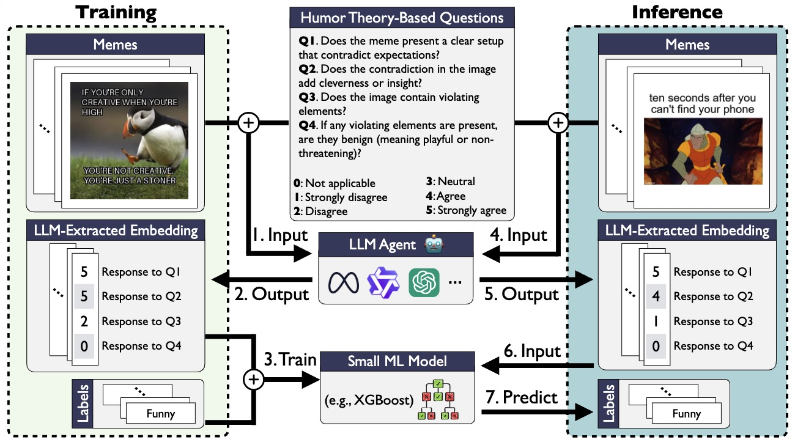
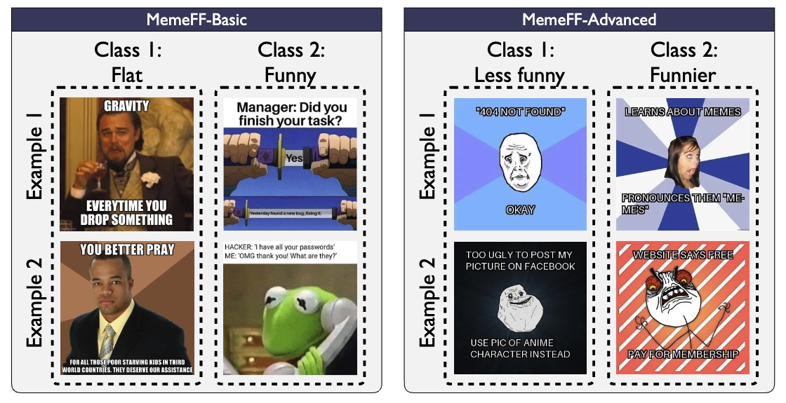

<h1 align="center"> <p>Humor-Aware AI: Evaluating and Improving LLMs in Meme Analysis</p></h1>
<h4 align="center">
    <p>
      <a href="https://yzeng58.github.io/" target="_blank">Yuchen Zeng</a><sup>2*</sup>, 
      <a href="https://scholar.google.com/citations?user=cvaTlWgAAAAJ&hl=en" target="_blank">Hemang Rajvanshy</a><sup>1</sup>, 
      <a href="https://wonjunn.github.io/">Wonjun Kang</a><sup>3,4</sup>, 
      <a href="https://jifanz.github.io/" target="_blank">Jifan Zhang</a><sup>2</sup>, 
      <a href="https://en.wikipedia.org/wiki/Bob_Mankoff" target="_blank">Bob Mankoff</a><sup>5</sup>, 
      <a href="https://kangwooklee.com/aboutme/" target="_blank">Kangwook Lee</a><sup>2</sup>
      <a href="https://easonnie.github.io/" target="_blank">Yixin Nie</a><sup>1</sup>, 
      <a href="https://yipin.github.io/" target="_blank">Yipin Zhou</a><sup>1</sup>
  </p>
  <p>
    <sup>1</sup>Meta GenAI, <sup>2</sup>University of Wisconsin-Madison,
    <sup>3</sup>FuriosaAI, <sup>4</sup>Seoul National University,
    <sup>5</sup>Air Mail and Cartoon Collections <br>
    <sup>*</sup>Work done during internship at Meta GenAI
   </p>
    </h4>
<p align="center">
    <a href="https://github.com/yzeng58/memeGen/releases">
        
    </a>
    <a href="https://arxiv.org/abs/2402.01293">
        
    </a>
    <a href="https://huggingface.co/datasets/yzeng58/CoBSAT">
        
    </a>
</p>

**Abstract**: Large Language Models (LLMs) have been studied for humor-related tasks like joke understanding and generation, yet meme evaluation—a highly shared form of humor—remains largely unexplored. This work presents the first comprehensive benchmark for evaluating LLMs' meme humor capabilities, covering dataset creation, benchmarking, performance improvement, and extending to meme generation. We present two datasets, MemeFF-Basic and MemeFF-Advanced, to assess humor evaluation across different difficulty levels. We benchmark LLMs on our datasets and find that while they perform well on Meme-Basic, their performance drops significantly on Meme-Advanced, with reasoning providing little to no improvement. To address this, we propose MemeSage, an agent-based approach inspired by humor theory. In this framework, LLMs function as agents that, for each meme, answer multiple-choice questions derived from humor theory. The responses, encoded as structured features, are then fed into a lightweight machine learning model (e.g., XGBoost), to produce the final prediction. By explicitly embedding humor theory as a guiding structure, this method enhances evaluation through a form of guided reasoning, resulting in substantial improvements in meme evaluation performance. Lastly, we also benchmark LLMs in meme generation, and explore how MemeSage can be used to enhance the quality of generated outputs.




# News  🚀

Empty.

# Contents

- [Step 1: Set Up Environment](#step-1-set-up-environment)
- [Step 2: Download Dataset](#step-2-download-dataset)
- [Step 3: Select MLLMs](#step-3-select-mllms)
  - [Supported Models](#supported-models)
  - [Feature Your Own Model](#feature-your-own-model)

# Step 1: Set Up Environment

To set up the environment for benchmarking LLMs on meme humor, please follow the following steps. This works for linux. 

1. Clone this repository.

   ```bash
   git clone https://github.com/yzeng58/memeSage
   ```

2. Install dependencies.

   ```bash
   # create the environment that works for all experiments in our paper
   conda env create -f conda_env.yml
   conda activate meme
   ```

3. Create `environment.py` in the `memeSage` directory. Note that many variables need you to config except `root_dir` on your own

   ```python
    import os
    root_dir = os.path.dirname(os.path.abspath(__file__))
    
    OPENAI_API_KEY = {
        'your_openai_api_key_name1': 'your_openai_api_key1',
        'your_openai_api_key_name2': 'your_openai_api_key2',
        ...
    }
    HUGGINGFACE_API_KEY = {
        'your_huggingface_api_key_name1': 'your_huggingface_api_key1',
        'your_huggingface_api_key_name2': 'your_huggingface_api_key2',
        ...
    }

    # We also implemented Claude, but did not include it in our paper as it was too conservative and frequently refused to answer.
    CLAUDE_API_KEY = {
        'your_claude_api_key_name1': 'your_claude_api_key1',
        'your_claude_api_key_name2': 'your_claude_api_key2',
        ...
    }
    GEMINI_API_KEY = {
        'your_gemini_api_key_name1': 'your_gemini_api_key1',
        'your_gemini_api_key_name2': 'your_gemini_api_key2',
        ...
    }
    
    # [OPTIONAL] Change Cache Path if you want to use your own cache path
    HF_HOME = "your_path_for_huggingface_cache"
    TRANSFORMERS_CACHE = "your_path_for_huggingface_cache/hub"
    TRITON_CACHE_DIR="your_path_for_triton_cache"
    
    WANDB_INFO = {
        'project': 'memeSage',
        'entity': 'your_entity',
    }
    ```
    
    **Important: Do not commit this file to version control**. This file contains sensitive API keys and should not be synced via GitHub or any other version control system to prevent security risks.

5. [Optional] If you want to perform fine-tuning, please install our variant of Llama-Factory. 

    ```bash
    git clone https://github.com/yzeng58/LLaMA-Factory
    cd Llama-Factory
    pip install -e ".[torch,metrics]"
    cd ..
    ```

# Step 2: Download Dataset


To use our dataset, please follow the following steps. 

1. Download the complete dataset package which includes:
   - MemeFF-Basic dataset (images and descriptions for meme evaluation)
   - MemeFF-Advanced dataset (images and descriptions for meme evaluation)
   - British complaints dataset (used for meme generation)

    ```bash
    wget https://huggingface.co/datasets/yzeng58/MemeFF/resolve/main/resources.zip
    ```

2. Uncompress the `resources.zip` file via `unzip resources.zip` and move the `resources` folder to the `memeSage` directory.

Up to now, the structure of the `memeSage` directory should be like this:

```bash
memeSage/
├── load_datasets/
│   ├── load_basic.py # memeFF-basic
│   ├── load_advanced.py # memeFF-advanced
│   └── load_british_complaints.py # british complaints for meme generation
├── load_models/
│   ├── load_claude.py
│   ├── load_deepseek.py
│   ├── load_gemini.py
│   ├── load_gpt.py
│   ├── load_llama.py
│   ├── load_mistral.py
│   ├── load_pixtral.py
│   ├── load_qwen.py
│   ├── load_sd.py
|   └── load_your_model # [optional] create a python file to load your own model
├── resources/datasets
│   ├── advanced/
│   ├── basic/
│   └── british_complaints/
├── ...
├── environment.py # follow the instructions in Step 1
├── load_model.py # [optional] add your own model
└── ...
```

# Step 3: Select MLLMs

We have implemented many state-of-the-art models for your convenience. Additionally, we offer guidelines for integrating your own models.

## Supported LLMs

- [x] [GPT](https://openai.com/)
    * Multimodal models
        * `gpt-4o-mini`
        * `gpt-4o`
        * `gpt-4-turbo-2024-04-09`
        * `gpt-4o-2024-08-06`
        * `o1-2024-12-17`
- [x] [Claude](https://www.anthropic.com/)
    * Multimodal models
        * `claude-3-haiku-20240307`
        * `claude-3-sonnet-20240229`
- [x] [Llama](https://github.com/facebookresearch/llama)
    * Multimodal models (Note: Llama-3.2 models can only process a single image input per prompt, therefore they only support independent meme evaluation)
        * `Llama-3.2-11B-Vision-Instruct`
        * `Llama-3.2-90B-Vision-Instruct`
    * Text-only models
        * `Llama-3.1-405B-Instruct`
        * `Llama-3.1-8B-Instruct`
        * `Llama-3.1-70B-Instruct`
- [x] [Qwen](https://github.com/QwenLM/Qwen)
    * Multimodal models
        * `Qwen2-VL-2B-Instruct`
        * `Qwen2-VL-7B-Instruct`
        * `Qwen2-VL-72B-Instruct`
    * Text-only models
        * `Qwen2.5-0.5B-Instruct`
        * `Qwen2.5-1.5B-Instruct`
        * `Qwen2.5-3B-Instruct`
        * `Qwen2.5-7B-Instruct`
        * `Qwen2.5-14B-Instruct`
        * `Qwen2.5-32B-Instruct`
        * `Qwen2.5-72B-Instruct`
- [x] [Mistral](https://github.com/mistralai)
    * Multimodal model
        * `pixtral-12b`
    * Text-only models
        * `Mistral-7B-Instruct-v0.3`
        * `Mixtral-8x22B-Instruct-v0.1`
        * `Mistral-Large-Instruct-2407`
        * `Mistral-Small-Instruct-2409`
- [x] [Gemini](https://gemini.google.com/)
    * Multimodal models
        * `gemini-1.5-flash`
        * `gemini-1.5-flash-8b`
        * `gemini-1.5-pro`
        * `gemini-1.0-pro`
        * `gemini-2.0-flash`
- [x] [DeepSeek](https://deepseek.com/)
    * Text-only models
        * `DeepSeek-R1-Distill-Qwen-32B`
        * `DeepSeek-R1-Distill-Llama-70B`

## Supported Image Generation Models

- [x] [Stable Diffusion](https://github.com/CompVis/stable-diffusion)
    * `stable-diffusion-3-medium-diffusers`

## Feature Your Own Model

Throughout this section, the placeholder `OwnModel` will be substituted with the name of your model, such as `Baichuan-7B`.

1. Create python file `load_OwnModel.py` in the `load_models` directory.

    <details>
    <summary> <code>load_OwnModel.py</code> template </summary>
    Your `load_OwnModel.py` script should include at least the following essential functions:

    - **`load_OwnModel`**: Responsible for loading the model or setting up an API client to prevent redundant loading operations during inference or fine-tuning processes.
    - **`call_OwnModel`**: Employs the model to perform inference tasks.

    ```python
    def load_OwnModel(
        model_path,
        ...
    ):
        ...
        return {
            ...
        }
    ```

    For `model_path`, follow this naming convention:
    - Use `f"{model_name}/pretrained"` for original pretrained models
    - Use `f"{model_name}/{variant_name}"` for custom fine-tuned models
    
    For example, `Llama-3.1-70B-Instruct/pretrained` refers to the original model, while `Llama-3.1-70B-Instruct/qlora_basic` indicates a variant fine-tuned with QLoRA on the basic dataset.

    The function should return a dictionary that will be passed to `call_OwnModel`. The structure typically includes:
    - For Hugging Face models: keys for `tokenizer` and `model`
    - For closed-source API models: keys for `client` and `api_key`
    
    You may customize additional input parameters and return value formats based on your specific requirements.

   ```python
   def call_OwnModel(
       model,
       prompt,
       image_paths: list[str] = [],
       history = None,
       save_history = False,
       description = '',
       context = "",
       temperature: float = 0.0,
       demonstrations = None,
       ...
   ):
        ...
        return output_dict
   ```

    * Required Parameters for Function `call_OwnModel`
        * `model`: The dictionary returned by `load_OwnModel`. You may rename this parameter if needed.
        * `prompt`: The text prompt to be sent to the model.
        * `image_paths`: A list of paths to images that will be processed by the model.
        * `description`: Specifies which description category to use from the dataset. For example, in `resources/datasets/basic/description/`, you'll find subfolders like `gemini-1.5-pro` and `Llama-3.2-90B-Vision-Instruct`, indicating descriptions generated by these models. When this parameter is non-empty, text descriptions will replace image inputs.
        * `context`: Specifies which context category to use. When non-empty, additional meme descriptions will be added to the prompt while preserving image inputs. Context categories match the naming of description categories.
        * `history`: Previous conversation history to maintain context across multiple interactions.
        * `save_history`: Boolean flag indicating whether to save conversation history.

    * Return Value for Function `call_OwnModel`
        * The function should return a dictionary containing at minimum:
            * `output`: The model's generated response.
        * Additional keys can be included as needed for your implementation.

    For implementation examples, see [`load_gpt.py`](load_models/load_gpt.py) for closed-source API models and [`load_llama.py`](load_models/load_llama.py) for Hugging Face models.
    
    </details>

2. Add your model to the [`load_model.py`](load_model.py) file.

 <details><summary> <code>load_model.py</code> template </summary>

   ```python
       elif 'OwnModel' in model_name.lower():
           from load_models.load_OwnModel import load_OwnModel, call_OwnModel
   			model = load_OwnModel(model_path, ...)
           return lambda *args, **kwargs: call_OwnModel(model, *args, **kwargs)
   ```

   You can check our implementation for other models for example. For your own model, typically you need to load the model first, and then use `call_OwnModel` to make the infernece. Here is one example usage:

   ```python
    >>> from load_model import load_model
    >>> call_model = load_model("gemini-1.5-flash/pretrained")
    >>> call_model("how are you?")
    {'output': 'I am doing well, thank you for asking!  How are you today?\n'}
   ```

   </details>

4. Add your model to [`configs.py`](configs.py).

    If your model is LLM, add it to the `support_llms` dictionary.

   ```python
   support_llms = {
       'gpt': [
        'gpt-4o',
        'gpt-4o-mini',
        'gpt-4-turbo-2024-04-09',
        'gpt-4o-2024-08-06',
        'o1-2024-12-17',
       ],
       ...
       'OwnModel': [
           ...
       ] # Add your model names here. For a single model, include just that name in the list.
   }
   ```

    If your model is image generation model, add it to the `support_diffusers` dictionary.

    ```python
    support_diffusers = {
        'sd': [
            ...
        ],
        ...
        'OwnModel': [
            ...
        ] # Add your model names here. For a single model, include just that name in the list.
    }
    ```

# Step 4: Benchmark LLMs

   
    ```bash
    # basic
    python evaluation.py --dataset_name basic --data_mode test --eval_mode single --n_demos 2
    python evaluation.py --n_pairs 2000 --dataset_name basic --data_mode test --prompt_name single --n_demos 2 --not_load_model --wandb

    # Relca
    python evaluation.py --dataset_name advanced --data_mode test --eval_mode single --n_demos 2
    python evaluation.py --n_pairs 2000 --dataset_name advanced --data_mode test --prompt_name single --n_demos 2 --not_load_model --wandb
```

### Pairwise Meme Comparison

```bash
# basic 
python evaluation.py --n_pairs 2000 --dataset_name basic --data_mode test --eval_mode pairwise --wandb

# relca
python evaluation.py --n_pairs 2000 --dataset_name advanced --data_mode test --eval_mode pairwise --wandb

```

<details>
<summary>Click to expand full experiments</summary>

### Pairwise Meme Comparison

#### Qwen-VL
```bash
python evaluation.py --n_pairs 2000 --dataset_name basic --data_mode test --eval_mode pairwise --wandb --model_name Qwen2-VL-2B-Instruct
python evaluation.py --n_pairs 2000 --dataset_name basic --data_mode test --eval_mode pairwise --wandb --model_name Qwen2-VL-7B-Instruct
python evaluation.py --n_pairs 2000 --dataset_name basic --data_mode test --eval_mode pairwise --wandb --model_name Qwen2-VL-72B-Instruct

python evaluation.py --n_pairs 2000 --dataset_name advanced --data_mode test --eval_mode pairwise --wandb --model_name Qwen2-VL-2B-Instruct
python evaluation.py --n_pairs 2000 --dataset_name advanced --data_mode test --eval_mode pairwise --wandb --model_name Qwen2-VL-7B-Instruct
python evaluation.py --n_pairs 2000 --dataset_name advanced --data_mode test --eval_mode pairwise --wandb --model_name Qwen2-VL-72B-Instruct
```

#### GPT
```bash
python evaluation.py --n_pairs 2000 --dataset_name basic --data_mode test --eval_mode pairwise --wandb --model_name gpt-4o-mini
python evaluation.py --n_pairs 2000 --dataset_name basic --data_mode test --eval_mode pairwise --wandb --model_name gpt-4o

python evaluation.py --n_pairs 2000 --dataset_name advanced --data_mode test --eval_mode pairwise --wandb --model_name gpt-4o-mini
python evaluation.py --n_pairs 2000 --dataset_name advanced --data_mode test --eval_mode pairwise --wandb --model_name gpt-4o
```

#### Pixtral
```bash
python evaluation.py --n_pairs 2000 --dataset_name basic --data_mode test --eval_mode pairwise --wandb --model_name pixtral-12b 

python evaluation.py --n_pairs 2000 --dataset_name advanced --data_mode test --eval_mode pairwise --wandb --model_name pixtral-12b 
```

#### Gemini
```bash
python evaluation.py --n_pairs 2000 --dataset_name basic --data_mode test --eval_mode pairwise --wandb --model_name gemini-1.5-flash
python evaluation.py --n_pairs 2000 --dataset_name basic --data_mode test --eval_mode pairwise --wandb --model_name gemini-1.5-pro

python evaluation.py --n_pairs 2000 --dataset_name advanced --data_mode test --eval_mode pairwise --wandb --model_name gemini-1.5-flash
python evaluation.py --n_pairs 2000 --dataset_name advanced --data_mode test --eval_mode pairwise --wandb --model_name gemini-1.5-pro
```

### Single Meme Evaluation 
#### Qwen-VL
```bash
python evaluation.py --dataset_name advanced --data_mode test --eval_mode single --n_demos 2 --model_name Qwen2-VL-2B-Instruct
python evaluation.py --n_pairs 2000 --dataset_name advanced --data_mode test --prompt_name single --n_demos 2 --not_load_model --wandb --model_name Qwen2-VL-2B-Instruct

python evaluation.py --dataset_name advanced --data_mode test --eval_mode single --n_demos 2 --model_name Qwen2-VL-7B-Instruct
python evaluation.py --n_pairs 2000 --dataset_name advanced --data_mode test --prompt_name single --n_demos 2 --not_load_model --wandb --model_name Qwen2-VL-7B-Instruct

python evaluation.py --dataset_name advanced --data_mode test --eval_mode single --n_demos 2 --model_name Qwen2-VL-72B-Instruct
python evaluation.py --n_pairs 2000 --dataset_name advanced --data_mode test --prompt_name single --n_demos 2 --not_load_model --wandb --model_name Qwen2-VL-72B-Instruct

python evaluation.py --dataset_name basic --data_mode test --eval_mode single --n_demos 2 --model_name Qwen2-VL-2B-Instruct
python evaluation.py --n_pairs 2000 --dataset_name basic --data_mode test --prompt_name single --n_demos 2 --not_load_model --wandb --model_name Qwen2-VL-2B-Instruct

python evaluation.py --dataset_name basic --data_mode test --eval_mode single --n_demos 2 --model_name Qwen2-VL-7B-Instruct
python evaluation.py --n_pairs 2000 --dataset_name basic --data_mode test --prompt_name single --n_demos 2 --not_load_model --wandb --model_name Qwen2-VL-7B-Instruct

python evaluation.py --dataset_name basic --data_mode test --eval_mode single --n_demos 2 --model_name Qwen2-VL-72B-Instruct
python evaluation.py --n_pairs 2000 --dataset_name basic --data_mode test --prompt_name single --n_demos 2 --not_load_model --wandb --model_name Qwen2-VL-72B-Instruct
```

#### GPT
```bash
python evaluation.py --dataset_name advanced --data_mode test --eval_mode single --n_demos 2 --model_name gpt-4o-mini
python evaluation.py --n_pairs 2000 --dataset_name advanced --data_mode test --prompt_name single --n_demos 2 --not_load_model --wandb --model_name gpt-4o-mini

python evaluation.py --dataset_name advanced --data_mode test --eval_mode single --n_demos 2 --model_name gpt-4o
python evaluation.py --n_pairs 2000 --dataset_name advanced --data_mode test --prompt_name single --n_demos 2 --not_load_model --wandb --model_name gpt-4o

python evaluation.py --dataset_name basic --data_mode test --eval_mode single --n_demos 2 --model_name gpt-4o-mini
python evaluation.py --n_pairs 2000 --dataset_name basic --data_mode test --prompt_name single --n_demos 2 --not_load_model --wandb --model_name gpt-4o-mini

python evaluation.py --dataset_name basic --data_mode test --eval_mode single --n_demos 2 --model_name gpt-4o
python evaluation.py --n_pairs 2000 --dataset_name basic --data_mode test --prompt_name single --n_demos 2 --not_load_model --wandb --model_name gpt-4o
```

#### Pixtral
```bash
python evaluation.py --dataset_name basic --data_mode test --eval_mode single --n_demos 2 --model_name pixtral-12b
python evaluation.py --n_pairs 2000 --dataset_name basic --data_mode test --prompt_name single --n_demos 2 --not_load_model --wandb --model_name pixtral-12b

python evaluation.py --dataset_name advanced --data_mode test --eval_mode single --n_demos 2 --model_name pixtral-12b
python evaluation.py --n_pairs 2000 --dataset_name advanced --data_mode test --prompt_name single --n_demos 2 --not_load_model --wandb --model_name pixtral-12b
```

#### Gemini
```bash
python evaluation.py --dataset_name basic --data_mode test --eval_mode single --n_demos 2 --model_name gemini-1.5-flash
python evaluation.py --n_pairs 2000 --dataset_name basic --data_mode test --prompt_name single --n_demos 2 --not_load_model --wandb --model_name gemini-1.5-flash

python evaluation.py --dataset_name advanced --data_mode test --eval_mode single --n_demos 2 --model_name gemini-1.5-flash
python evaluation.py --n_pairs 2000 --dataset_name advanced --data_mode test --prompt_name single --n_demos 2 --not_load_model --wandb --model_name gemini-1.5-flash

python evaluation.py --dataset_name basic --data_mode test --eval_mode single --n_demos 2 --model_name gemini-1.5-pro
python evaluation.py --n_pairs 2000 --dataset_name basic --data_mode test --prompt_name single --n_demos 2 --not_load_model --wandb --model_name gemini-1.5-pro

python evaluation.py --dataset_name advanced --data_mode test --eval_mode single --n_demos 2 --model_name gemini-1.5-pro
python evaluation.py --n_pairs 2000 --dataset_name advanced --data_mode test --prompt_name single --n_demos 2 --not_load_model --wandb --model_name gemini-1.5-pro 
```

#### LLama-3.2
```bash
python evaluation.py --dataset_name basic --data_mode test --eval_mode single --n_demos 2 --model_name Llama-3.2-11B-Vision-Instruct
python evaluation.py --n_pairs 2000 --dataset_name basic --data_mode test --prompt_name single --n_demos 2 --not_load_model --wandb --model_name Llama-3.2-11B-Vision-Instruct

python evaluation.py --dataset_name advanced --data_mode test --eval_mode single --n_demos 2 --model_name Llama-3.2-11B-Vision-Instruct
python evaluation.py --n_pairs 2000 --dataset_name advanced --data_mode test --prompt_name single --n_demos 2 --not_load_model --wandb --model_name Llama-3.2-11B-Vision-Instruct

python evaluation.py --dataset_name basic --data_mode test --eval_mode single --n_demos 2 --model_name Llama-3.2-90B-Vision-Instruct
python evaluation.py --n_pairs 2000 --dataset_name basic --data_mode test --prompt_name single --n_demos 2 --not_load_model --wandb --model_name Llama-3.2-90B-Vision-Instruct

python evaluation.py --dataset_name advanced --data_mode test --eval_mode single --n_demos 2 --model_name Llama-3.2-90B-Vision-Instruct
python evaluation.py --n_pairs 2000 --dataset_name advanced --data_mode test --prompt_name single --n_demos 2 --not_load_model --wandb --model_name Llama-3.2-90B-Vision-Instruct
```
</details>

## Improving Meme Humor Benchmarking Without Model Updates

### Single Meme Evaluation

#### Chain of Thought

```bash
##############
# Multimodal #
##############

# use saved description
python evaluation.py --context Llama-3.2-90B-Vision-Instruct --data_mode test --eval_mode single --n_demos 2
python evaluation.py --n_pairs 2000 --context Llama-3.2-90B-Vision-Instruct --data_mode test --prompt_name single --n_demos 2 --not_load_model --wandb

#################
# Language-only #
#################

# use saved description
python evaluation.py --description Llama-3.2-90B-Vision-Instruct --data_mode test --eval_mode single --n_demos 2
python evaluation.py --n_pairs 2000 --description Llama-3.2-90B-Vision-Instruct --data_mode test --prompt_name single --n_demos 2 --not_load_model --wandb

```

<details>
<summary>Click to expand full experiments</summary>

##### Qwen2-VL-72B-Instruct
```bash
# TODO
python evaluation.py --context Llama-3.2-90B-Vision-Instruct --data_mode test --eval_mode single --n_demos 2 --model_name Qwen2-VL-72B-Instruct --dataset_name relca
python evaluation.py --n_pairs 2000 --context Llama-3.2-90B-Vision-Instruct --data_mode test --prompt_name single --n_demos 2 --not_load_model --wandb --model_name Qwen2-VL-72B-Instruct --dataset_name relca

python evaluation.py --description Llama-3.2-90B-Vision-Instruct --data_mode test --eval_mode single --n_demos 2 --model_name Qwen2-VL-72B-Instruct --dataset_name advanced
python evaluation.py --n_pairs 2000 --description Llama-3.2-90B-Vision-Instruct --data_mode test --prompt_name single --n_demos 2 --not_load_model --wandb --model_name Qwen2-VL-72B-Instruct --dataset_name advanced

# TODO
python evaluation.py --context Llama-3.2-90B-Vision-Instruct --data_mode test --eval_mode single --n_demos 2 --model_name Qwen2-VL-72B-Instruct --dataset_name basic
python evaluation.py --n_pairs 2000 --context Llama-3.2-90B-Vision-Instruct --data_mode test --prompt_name single --n_demos 2 --not_load_model --wandb --model_name Qwen2-VL-72B-Instruct --dataset_name basic

python evaluation.py --description Llama-3.2-90B-Vision-Instruct --data_mode test --eval_mode single --n_demos 2 --model_name Qwen2-VL-72B-Instruct --dataset_name basic
python evaluation.py --n_pairs 2000 --description Llama-3.2-90B-Vision-Instruct --data_mode test --prompt_name single --n_demos 2 --not_load_model --wandb --model_name Qwen2-VL-72B-Instruct --dataset_name basic
```

##### Llama-3.2-90B-Vision-Instruct
```bash
python evaluation.py --context Llama-3.2-90B-Vision-Instruct --data_mode test --eval_mode single --n_demos 2 --model_name Llama-3.2-90B-Vision-Instruct --dataset_name advanced
python evaluation.py --n_pairs 2000 --context Llama-3.2-90B-Vision-Instruct --data_mode test --prompt_name single --n_demos 2 --not_load_model --wandb --model_name Llama-3.2-90B-Vision-Instruct --dataset_name advanced

python evaluation.py --context Llama-3.2-90B-Vision-Instruct --data_mode test --eval_mode single --n_demos 2 --model_name Llama-3.2-90B-Vision-Instruct --dataset_name basic
python evaluation.py --n_pairs 2000 --context Llama-3.2-90B-Vision-Instruct --data_mode test --prompt_name single --n_demos 2 --not_load_model --wandb --model_name Llama-3.2-90B-Vision-Instruct --dataset_name basic
```

##### Pixtral-12b
```bash
# TODO
python evaluation.py --context Llama-3.2-90B-Vision-Instruct --data_mode test --eval_mode single --n_demos 2 --model_name pixtral-12b --dataset_name relca
python evaluation.py --n_pairs 2000 --context Llama-3.2-90B-Vision-Instruct --data_mode test --prompt_name single --n_demos 2 --not_load_model --wandb --model_name pixtral-12b --dataset_name relca

python evaluation.py --description Llama-3.2-90B-Vision-Instruct --data_mode test --eval_mode single --n_demos 2 --model_name pixtral-12b --dataset_name advanced
python evaluation.py --n_pairs 2000 --description Llama-3.2-90B-Vision-Instruct --data_mode test --prompt_name single --n_demos 2 --not_load_model --wandb --model_name pixtral-12b --dataset_name advanced

# TODO
python evaluation.py --context Llama-3.2-90B-Vision-Instruct --data_mode test --eval_mode single --n_demos 2 --model_name pixtral-12b --dataset_name basic
python evaluation.py --n_pairs 2000 --context Llama-3.2-90B-Vision-Instruct --data_mode test --prompt_name single --n_demos 2 --not_load_model --wandb --model_name pixtral-12b --dataset_name basic

python evaluation.py --description Llama-3.2-90B-Vision-Instruct --data_mode test --eval_mode single --n_demos 2 --model_name pixtral-12b --dataset_name basic
python evaluation.py --n_pairs 2000 --description Llama-3.2-90B-Vision-Instruct --data_mode test --prompt_name single --n_demos 2 --not_load_model --wandb --model_name pixtral-12b --dataset_name basic
```

##### GPT-4o
```bash
# TODO
python evaluation.py --context Llama-3.2-90B-Vision-Instruct --data_mode test --eval_mode single --n_demos 2 --model_name gpt-4o --dataset_name relca
python evaluation.py --n_pairs 2000 --context Llama-3.2-90B-Vision-Instruct --data_mode test --prompt_name single --n_demos 2 --not_load_model --wandb --model_name gpt-4o --dataset_name relca

# TODO
python evaluation.py --description Llama-3.2-90B-Vision-Instruct --data_mode test --eval_mode single --n_demos 2 --model_name gpt-4o --dataset_name relca
python evaluation.py --n_pairs 2000 --description Llama-3.2-90B-Vision-Instruct --data_mode test --prompt_name single --n_demos 2 --not_load_model --wandb --model_name gpt-4o --dataset_name relca

# TODO
python evaluation.py --context Llama-3.2-90B-Vision-Instruct --data_mode test --eval_mode single --n_demos 2 --model_name gpt-4o --dataset_name basic
python evaluation.py --n_pairs 2000 --context Llama-3.2-90B-Vision-Instruct --data_mode test --prompt_name single --n_demos 2 --not_load_model --wandb --model_name gpt-4o --dataset_name basic

# TODO
python evaluation.py --description Llama-3.2-90B-Vision-Instruct --data_mode test --eval_mode single --n_demos 2 --model_name gpt-4o --dataset_name basic
python evaluation.py --n_pairs 2000 --description Llama-3.2-90B-Vision-Instruct --data_mode test --prompt_name single --n_demos 2 --not_load_model --wandb --model_name gpt-4o --dataset_name basic
```

##### gemini-1.5-pro
```bash
# TODO
python evaluation.py --context Llama-3.2-90B-Vision-Instruct --data_mode test --eval_mode single --n_demos 2 --model_name gemini-1.5-pro --dataset_name relca
python evaluation.py --n_pairs 2000 --context Llama-3.2-90B-Vision-Instruct --data_mode test --prompt_name single --n_demos 2 --not_load_model --wandb --model_name gemini-1.5-pro --dataset_name relca

# TODO
python evaluation.py --description Llama-3.2-90B-Vision-Instruct --data_mode test --eval_mode single --n_demos 2 --model_name gemini-1.5-pro --dataset_name relca
python evaluation.py --n_pairs 2000 --description Llama-3.2-90B-Vision-Instruct --data_mode test --prompt_name single --n_demos 2 --not_load_model --wandb --model_name gemini-1.5-pro --dataset_name relca

# TODO
python evaluation.py --context Llama-3.2-90B-Vision-Instruct --data_mode test --eval_mode single --n_demos 2 --model_name gemini-1.5-pro --dataset_name basic
python evaluation.py --n_pairs 2000 --context Llama-3.2-90B-Vision-Instruct --data_mode test --prompt_name single --n_demos 2 --not_load_model --wandb --model_name gemini-1.5-pro --dataset_name basic

# TODO
python evaluation.py --description Llama-3.2-90B-Vision-Instruct --data_mode test --eval_mode single --n_demos 2 --model_name gemini-1.5-pro --dataset_name basic
python evaluation.py --n_pairs 2000 --description Llama-3.2-90B-Vision-Instruct --data_mode test --prompt_name single --n_demos 2 --not_load_model --wandb --model_name gemini-1.5-pro --dataset_name basic
```

##### Mixtral/Mistral
```bash
python evaluation.py --description Llama-3.2-90B-Vision-Instruct --data_mode test --eval_mode single --n_demos 2 --model_name Mixtral-8x22B-Instruct-v0.1 --dataset_name advanced
python evaluation.py --n_pairs 2000 --description Llama-3.2-90B-Vision-Instruct --data_mode test --prompt_name single --n_demos 2 --not_load_model --wandb --model_name Mixtral-8x22B-Instruct-v0.1 --dataset_name advanced

python evaluation.py --description Llama-3.2-90B-Vision-Instruct --data_mode test --eval_mode single --n_demos 2 --model_name Mixtral-8x22B-Instruct-v0.1 --dataset_name basic
python evaluation.py --n_pairs 2000 --description Llama-3.2-90B-Vision-Instruct --data_mode test --prompt_name single --n_demos 2 --not_load_model --wandb --model_name Mixtral-8x22B-Instruct-v0.1 --dataset_name basic

python evaluation.py --description Llama-3.2-90B-Vision-Instruct --data_mode test --eval_mode single --n_demos 2 --model_name Mistral-Large-Instruct-2407 --dataset_name advanced
python evaluation.py --n_pairs 2000 --description Llama-3.2-90B-Vision-Instruct --data_mode test --prompt_name single --n_demos 2 --not_load_model --wandb --model_name Mistral-Large-Instruct-2407 --dataset_name advanced

python evaluation.py --description Llama-3.2-90B-Vision-Instruct --data_mode test --eval_mode single --n_demos 2 --model_name Mistral-Large-Instruct-2407 --dataset_name basic
python evaluation.py --n_pairs 2000 --description Llama-3.2-90B-Vision-Instruct --data_mode test --prompt_name single --n_demos 2 --not_load_model --wandb --model_name Mistral-Large-Instruct-2407 --dataset_name basic

python evaluation.py --description Llama-3.2-90B-Vision-Instruct --data_mode test --eval_mode single --n_demos 2 --model_name Mistral-7B-Instruct-v0.3 --dataset_name advanced
python evaluation.py --n_pairs 2000 --description Llama-3.2-90B-Vision-Instruct --data_mode test --prompt_name single --n_demos 2 --not_load_model --wandb --model_name Mistral-7B-Instruct-v0.3 --dataset_name advanced

python evaluation.py --description Llama-3.2-90B-Vision-Instruct --data_mode test --eval_mode single --n_demos 2 --model_name Mistral-7B-Instruct-v0.3 --dataset_name basic
python evaluation.py --n_pairs 2000 --description Llama-3.2-90B-Vision-Instruct --data_mode test --prompt_name single --n_demos 2 --not_load_model --wandb --model_name Mistral-7B-Instruct-v0.3 --dataset_name basic
```

##### Llama-3.1 
```bash
python evaluation.py --description Llama-3.2-90B-Vision-Instruct --data_mode test --eval_mode single --n_demos 2 --model_name Llama-3.1-70B-Instruct --dataset_name advanced
python evaluation.py --n_pairs 2000 --description Llama-3.2-90B-Vision-Instruct --data_mode test --prompt_name single --n_demos 2 --not_load_model --wandb --model_name Llama-3.1-70B-Instruct --dataset_name advanced

python evaluation.py --description Llama-3.2-90B-Vision-Instruct --data_mode test --eval_mode single --n_demos 2 --model_name Llama-3.1-70B-Instruct --dataset_name basic
python evaluation.py --n_pairs 2000 --description Llama-3.2-90B-Vision-Instruct --data_mode test --prompt_name single --n_demos 2 --not_load_model --wandb --model_name Llama-3.1-70B-Instruct --dataset_name basic

python evaluation.py --description Llama-3.2-90B-Vision-Instruct --data_mode test --eval_mode single --n_demos 2 --model_name Llama-3.1-8B-Instruct --dataset_name advanced
python evaluation.py --n_pairs 2000 --description Llama-3.2-90B-Vision-Instruct --data_mode test --prompt_name single --n_demos 2 --not_load_model --wandb --model_name Llama-3.1-8B-Instruct --dataset_name advanced

python evaluation.py --description Llama-3.2-90B-Vision-Instruct --data_mode test --eval_mode single --n_demos 2 --model_name Llama-3.1-8B-Instruct --dataset_name basic
python evaluation.py --n_pairs 2000 --description Llama-3.2-90B-Vision-Instruct --data_mode test --prompt_name single --n_demos 2 --not_load_model --wandb --model_name Llama-3.1-8B-Instruct --dataset_name basic
```

##### Qwen2.5
```bash
python evaluation.py --description Llama-3.2-90B-Vision-Instruct --data_mode test --eval_mode single --n_demos 2 --model_name Qwen2.5-14B-Instruct --dataset_name advanced
python evaluation.py --n_pairs 2000 --description Llama-3.2-90B-Vision-Instruct --data_mode test --prompt_name single --n_demos 2 --not_load_model --wandb --model_name Qwen2.5-14B-Instruct --dataset_name advanced

python evaluation.py --description Llama-3.2-90B-Vision-Instruct --data_mode test --eval_mode single --n_demos 2 --model_name Qwen2.5-14B-Instruct --dataset_name basic
python evaluation.py --n_pairs 2000 --description Llama-3.2-90B-Vision-Instruct --data_mode test --prompt_name single --n_demos 2 --not_load_model --wandb --model_name Qwen2.5-14B-Instruct --dataset_name basic

python evaluation.py --description Llama-3.2-90B-Vision-Instruct --data_mode test --eval_mode single --n_demos 2 --model_name Qwen2.5-72B-Instruct --dataset_name advanced
python evaluation.py --n_pairs 2000 --description Llama-3.2-90B-Vision-Instruct --data_mode test --prompt_name single --n_demos 2 --not_load_model --wandb --model_name Qwen2.5-72B-Instruct --dataset_name advanced

python evaluation.py --description Llama-3.2-90B-Vision-Instruct --data_mode test --eval_mode single --n_demos 2 --model_name Qwen2.5-72B-Instruct --dataset_name basic
python evaluation.py --n_pairs 2000 --description Llama-3.2-90B-Vision-Instruct --data_mode test --prompt_name single --n_demos 2 --not_load_model --wandb --model_name Qwen2.5-72B-Instruct --dataset_name basic
```
</details>

#### In-Context Learning

```bash
python evaluation.py --data_mode test --eval_mode single --n_demos 4
python evaluation.py --n_pairs 2000 --data_mode test --prompt_name single --n_demos 4 --not_load_model --wandb
```

<details>
<summary>Click to expand full experiments</summary>

##### Qwen2-VL-72B-Instruct
```bash
python evaluation.py --data_mode test --eval_mode single --n_demos 4 --model_name Qwen2-VL-72B-Instruct --dataset_name advanced
python evaluation.py --n_pairs 2000 --data_mode test --prompt_name single --n_demos 4 --not_load_model --wandb --model_name Qwen2-VL-72B-Instruct --dataset_name advanced

python evaluation.py --data_mode test --eval_mode single --n_demos 6 --model_name Qwen2-VL-72B-Instruct --dataset_name advanced
python evaluation.py --n_pairs 2000 --data_mode test --prompt_name single --n_demos 6  --not_load_model --wandb --model_name Qwen2-VL-72B-Instruct --dataset_name advanced

python evaluation.py --data_mode test --eval_mode single --n_demos 8 --model_name Qwen2-VL-72B-Instruct --dataset_name advanced
python evaluation.py --n_pairs 2000 --data_mode test --prompt_name single --n_demos 8  --not_load_model --wandb --model_name Qwen2-VL-72B-Instruct --dataset_name advanced

python evaluation.py --data_mode test --eval_mode single --n_demos 4 --model_name Qwen2-VL-72B-Instruct --dataset_name basic
python evaluation.py --n_pairs 2000 --data_mode test --prompt_name single --n_demos 4 --not_load_model --wandb --model_name Qwen2-VL-72B-Instruct --dataset_name basic

python evaluation.py --data_mode test --eval_mode single --n_demos 6 --model_name Qwen2-VL-72B-Instruct --dataset_name basic
python evaluation.py --n_pairs 2000 --data_mode test --prompt_name single --n_demos 6  --not_load_model --wandb --model_name Qwen2-VL-72B-Instruct --dataset_name basic

python evaluation.py --data_mode test --eval_mode single --n_demos 8 --model_name Qwen2-VL-72B-Instruct --dataset_name basic
python evaluation.py --n_pairs 2000 --data_mode test --prompt_name single --n_demos 8  --not_load_model --wandb --model_name Qwen2-VL-72B-Instruct --dataset_name basic
```

##### Llama-3.2-90B-Vision-Instruct
```bash
python evaluation.py --data_mode test --eval_mode single --n_demos 4 --model_name Llama-3.2-90B-Vision-Instruct --dataset_name advanced
python evaluation.py --n_pairs 2000 --data_mode test --prompt_name single --n_demos 4 --not_load_model --wandb --model_name Llama-3.2-90B-Vision-Instruct --dataset_name advanced

python evaluation.py --data_mode test --eval_mode single --n_demos 6 --model_name Llama-3.2-90B-Vision-Instruct --dataset_name advanced
python evaluation.py --n_pairs 2000 --data_mode test --prompt_name single --n_demos 6  --not_load_model --wandb --model_name Llama-3.2-90B-Vision-Instruct --dataset_name advanced

python evaluation.py --data_mode test --eval_mode single --n_demos 4 --model_name Llama-3.2-90B-Vision-Instruct --dataset_name basic
python evaluation.py --n_pairs 2000 --data_mode test --prompt_name single --n_demos 4 --not_load_model --wandb --model_name Llama-3.2-90B-Vision-Instruct --dataset_name basic

python evaluation.py --data_mode test --eval_mode single --n_demos 6 --model_name Llama-3.2-90B-Vision-Instruct --dataset_name basic
python evaluation.py --n_pairs 2000 --data_mode test --prompt_name single --n_demos 6  --not_load_model --wandb --model_name Llama-3.2-90B-Vision-Instruct --dataset_name basic
```

##### Qwen2.5-72B-Instruct
```bash
python evaluation.py --data_mode test --eval_mode single --n_demos 4 --model_name Qwen2.5-72B-Instruct --dataset_name advanced --description Llama-3.2-90B-Vision-Instruct
python evaluation.py --n_pairs 2000 --data_mode test --prompt_name single --n_demos 4 --not_load_model --wandb --model_name Qwen2.5-72B-Instruct --dataset_name advanced --description Llama-3.2-90B-Vision-Instruct

python evaluation.py --data_mode test --eval_mode single --n_demos 6 --model_name Qwen2.5-72B-Instruct --dataset_name advanced --description Llama-3.2-90B-Vision-Instruct
python evaluation.py --n_pairs 2000 --data_mode test --prompt_name single --n_demos 6  --not_load_model --wandb --model_name Qwen2.5-72B-Instruct --dataset_name advanced --description Llama-3.2-90B-Vision-Instruct

python evaluation.py --data_mode test --eval_mode single --n_demos 8 --model_name Qwen2.5-72B-Instruct --dataset_name advanced --description Llama-3.2-90B-Vision-Instruct
python evaluation.py --n_pairs 2000 --data_mode test --prompt_name single --n_demos 8  --not_load_model --wandb --model_name Qwen2.5-72B-Instruct --dataset_name advanced --description Llama-3.2-90B-Vision-Instruct

python evaluation.py --data_mode test --eval_mode single --n_demos 4 --model_name Qwen2.5-72B-Instruct --dataset_name basic --description Llama-3.2-90B-Vision-Instruct
python evaluation.py --n_pairs 2000 --data_mode test --prompt_name single --n_demos 4 --not_load_model --wandb --model_name Qwen2.5-72B-Instruct --dataset_name basic --description Llama-3.2-90B-Vision-Instruct

python evaluation.py --data_mode test --eval_mode single --n_demos 6 --model_name Qwen2.5-72B-Instruct --dataset_name basic --description Llama-3.2-90B-Vision-Instruct
python evaluation.py --n_pairs 2000 --data_mode test --prompt_name single --n_demos 6  --not_load_model --wandb --model_name Qwen2.5-72B-Instruct --dataset_name basic --description Llama-3.2-90B-Vision-Instruct

python evaluation.py --data_mode test --eval_mode single --n_demos 8 --model_name Qwen2.5-72B-Instruct --dataset_name basic --description Llama-3.2-90B-Vision-Instruct
python evaluation.py --n_pairs 2000 --data_mode test --prompt_name single --n_demos 8  --not_load_model --wandb --model_name Qwen2.5-72B-Instruct --dataset_name basic --description Llama-3.2-90B-Vision-Instruct
```

##### Mixtral-8x22B-Instruct-v0.1
```bash --- continue
python evaluation.py --data_mode test --eval_mode single --n_demos 4 --model_name Mixtral-8x22B-Instruct-v0.1 --dataset_name advanced --description Llama-3.2-90B-Vision-Instruct
python evaluation.py --n_pairs 2000 --data_mode test --prompt_name single --n_demos 4 --not_load_model --wandb --model_name Mixtral-8x22B-Instruct-v0.1 --dataset_name advanced --description Llama-3.2-90B-Vision-Instruct

python evaluation.py --data_mode test --eval_mode single --n_demos 6 --model_name Mixtral-8x22B-Instruct-v0.1 --dataset_name advanced --description Llama-3.2-90B-Vision-Instruct
python evaluation.py --n_pairs 2000 --data_mode test --prompt_name single --n_demos 6  --not_load_model --wandb --model_name Mixtral-8x22B-Instruct-v0.1 --dataset_name advanced --description Llama-3.2-90B-Vision-Instruct

python evaluation.py --data_mode test --eval_mode single --n_demos 8 --model_name Mixtral-8x22B-Instruct-v0.1 --dataset_name advanced --description Llama-3.2-90B-Vision-Instruct
python evaluation.py --n_pairs 2000 --data_mode test --prompt_name single --n_demos 8  --not_load_model --wandb --model_name Mixtral-8x22B-Instruct-v0.1 --dataset_name advanced --description Llama-3.2-90B-Vision-Instruct

python evaluation.py --data_mode test --eval_mode single --n_demos 4 --model_name Mixtral-8x22B-Instruct-v0.1 --dataset_name basic --description Llama-3.2-90B-Vision-Instruct
python evaluation.py --n_pairs 2000 --data_mode test --prompt_name single --n_demos 4 --not_load_model --wandb --model_name Mixtral-8x22B-Instruct-v0.1 --dataset_name basic --description Llama-3.2-90B-Vision-Instruct

python evaluation.py --data_mode test --eval_mode single --n_demos 6 --model_name Mixtral-8x22B-Instruct-v0.1 --dataset_name basic --description Llama-3.2-90B-Vision-Instruct
python evaluation.py --n_pairs 2000 --data_mode test --prompt_name single --n_demos 6  --not_load_model --wandb --model_name Mixtral-8x22B-Instruct-v0.1 --dataset_name basic --description Llama-3.2-90B-Vision-Instruct

python evaluation.py --data_mode test --eval_mode single --n_demos 8 --model_name Mixtral-8x22B-Instruct-v0.1 --dataset_name basic --description Llama-3.2-90B-Vision-Instruct
python evaluation.py --n_pairs 2000 --data_mode test --prompt_name single --n_demos 8  --not_load_model --wandb --model_name Mixtral-8x22B-Instruct-v0.1 --dataset_name basic --description Llama-3.2-90B-Vision-Instruct
```

##### Llama-3.1-70B-Instruct
```bash
python evaluation.py --data_mode test --eval_mode single --n_demos 4 --model_name Llama-3.1-70B-Instruct --dataset_name advanced --description Llama-3.2-90B-Vision-Instruct
python evaluation.py --n_pairs 2000 --data_mode test --prompt_name single --n_demos 4 --not_load_model --wandb --model_name Llama-3.1-70B-Instruct --dataset_name advanced --description Llama-3.2-90B-Vision-Instruct

python evaluation.py --data_mode test --eval_mode single --n_demos 6 --model_name Llama-3.1-70B-Instruct --dataset_name advanced --description Llama-3.2-90B-Vision-Instruct
python evaluation.py --n_pairs 2000 --data_mode test --prompt_name single --n_demos 6  --not_load_model --wandb --model_name Llama-3.1-70B-Instruct --dataset_name advanced --description Llama-3.2-90B-Vision-Instruct

python evaluation.py --data_mode test --eval_mode single --n_demos 8 --model_name Llama-3.1-70B-Instruct --dataset_name advanced --description Llama-3.2-90B-Vision-Instruct
python evaluation.py --n_pairs 2000 --data_mode test --prompt_name single --n_demos 8  --not_load_model --wandb --model_name Llama-3.1-70B-Instruct --dataset_name advanced --description Llama-3.2-90B-Vision-Instruct

python evaluation.py --data_mode test --eval_mode single --n_demos 4 --model_name Llama-3.1-70B-Instruct --dataset_name basic --description Llama-3.2-90B-Vision-Instruct
python evaluation.py --n_pairs 2000 --data_mode test --prompt_name single --n_demos 4 --not_load_model --wandb --model_name Llama-3.1-70B-Instruct --dataset_name basic --description Llama-3.2-90B-Vision-Instruct

python evaluation.py --data_mode test --eval_mode single --n_demos 6 --model_name Llama-3.1-70B-Instruct --dataset_name basic --description Llama-3.2-90B-Vision-Instruct
python evaluation.py --n_pairs 2000 --data_mode test --prompt_name single --n_demos 6  --not_load_model --wandb --model_name Llama-3.1-70B-Instruct --dataset_name basic --description Llama-3.2-90B-Vision-Instruct

python evaluation.py --data_mode test --eval_mode single --n_demos 8 --model_name Llama-3.1-70B-Instruct --dataset_name basic --description Llama-3.2-90B-Vision-Instruct
python evaluation.py --n_pairs 2000 --data_mode test --prompt_name single --n_demos 8  --not_load_model --wandb --model_name Llama-3.1-70B-Instruct --dataset_name basic --description Llama-3.2-90B-Vision-Instruct
```

##### Pixtral-12b
```bash
python evaluation.py --data_mode test --eval_mode single --n_demos 4 --model_name pixtral-12b --dataset_name advanced
python evaluation.py --n_pairs 2000 --data_mode test --prompt_name single --n_demos 4 --not_load_model --wandb --model_name pixtral-12b --dataset_name advanced

python evaluation.py --data_mode test --eval_mode single --n_demos 6 --model_name pixtral-12b --dataset_name advanced
python evaluation.py --n_pairs 2000 --data_mode test --prompt_name single --n_demos 6  --not_load_model --wandb --model_name pixtral-12b --dataset_name advanced

python evaluation.py --data_mode test --eval_mode single --n_demos 8 --model_name pixtral-12b --dataset_name advanced
python evaluation.py --n_pairs 2000 --data_mode test --prompt_name single --n_demos 8  --not_load_model --wandb --model_name pixtral-12b --dataset_name advanced

python evaluation.py --data_mode test --eval_mode single --n_demos 4 --model_name pixtral-12b --dataset_name basic
python evaluation.py --n_pairs 2000 --data_mode test --prompt_name single --n_demos 4 --not_load_model --wandb --model_name pixtral-12b --dataset_name basic

python evaluation.py --data_mode test --eval_mode single --n_demos 6 --model_name pixtral-12b --dataset_name basic
python evaluation.py --n_pairs 2000 --data_mode test --prompt_name single --n_demos 6  --not_load_model --wandb --model_name pixtral-12b --dataset_name basic

python evaluation.py --data_mode test --eval_mode single --n_demos 8 --model_name pixtral-12b --dataset_name basic
python evaluation.py --n_pairs 2000 --data_mode test --prompt_name single --n_demos 8  --not_load_model --wandb --model_name pixtral-12b --dataset_name basic
```

##### GPT-4o
```bash
python evaluation.py --data_mode test --eval_mode single --n_demos 4 --model_name gpt-4o --dataset_name advanced
python evaluation.py --n_pairs 2000 --data_mode test --prompt_name single --n_demos 4 --not_load_model --wandb --model_name gpt-4o --dataset_name advanced

python evaluation.py --data_mode test --eval_mode single --n_demos 6 --model_name gpt-4o --dataset_name advanced
python evaluation.py --n_pairs 2000 --data_mode test --prompt_name single --n_demos 6  --not_load_model --wandb --model_name gpt-4o --dataset_name advanced

# TODO
python evaluation.py --data_mode test --eval_mode single --n_demos 4 --model_name gpt-4o --dataset_name basic
python evaluation.py --n_pairs 2000 --data_mode test --prompt_name single --n_demos 4 --not_load_model --wandb --model_name gpt-4o --dataset_name basic

# TODO
python evaluation.py --data_mode test --eval_mode single --n_demos 6 --model_name gpt-4o --dataset_name basic
python evaluation.py --n_pairs 2000 --data_mode test --prompt_name single --n_demos 6  --not_load_model --wandb --model_name gpt-4o --dataset_name basic
```

##### gemini-1.5-pro
```bash
python evaluation.py --data_mode test --eval_mode single --n_demos 4 --model_name gemini-1.5-pro --dataset_name advanced
python evaluation.py --n_pairs 2000 --data_mode test --prompt_name single --n_demos 4 --not_load_model --wandb --model_name gemini-1.5-pro --dataset_name advanced

python evaluation.py --data_mode test --eval_mode single --n_demos 6 --model_name gemini-1.5-pro --dataset_name advanced
python evaluation.py --n_pairs 2000 --data_mode test --prompt_name single --n_demos 6  --not_load_model --wandb --model_name gemini-1.5-pro --dataset_name advanced

python evaluation.py --data_mode test --eval_mode single --n_demos 4 --model_name gemini-1.5-pro --dataset_name basic
python evaluation.py --n_pairs 2000 --data_mode test --prompt_name single --n_demos 4 --not_load_model --wandb --model_name gemini-1.5-pro --dataset_name basic

python evaluation.py --data_mode test --eval_mode single --n_demos 6 --model_name gemini-1.5-pro --dataset_name basic
python evaluation.py --n_pairs 2000 --data_mode test --prompt_name single --n_demos 6  --not_load_model --wandb --model_name gemini-1.5-pro --dataset_name basic
```
</details>

#### Incorporating Humor Theory for Rating Memes

```bash
########################################
# advanced model (able to output json) #
########################################

python evaluation.py --data_mode test --eval_mode pairwise --prompt_name theory --theory_version v4 --data_mode both --n_pairs 2000 --train_ml_model xgboost --wandb

################
# normal model #
################
python evaluation.py --data_mode test --eval_mode pairwise --prompt_name theory --theory_version v5 --train_ml_model xgboost --data_mode both --n_pairs 2000 --wandb
```

<details>
<summary>Click to expand full experiments</summary>

##### Qwen2-VL-72B-Instruct
```bash
python evaluation.py --data_mode test --eval_mode pairwise --prompt_name theory --theory_version v4 --data_mode both --n_pairs 2000 --train_ml_model xgboost --wandb --dataset_name advanced --model_name Qwen2-VL-72B-Instruct

python evaluation.py --data_mode test --eval_mode pairwise --prompt_name theory --theory_version v4 --data_mode both --n_pairs 2000 --train_ml_model xgboost --wandb --dataset_name basic --model_name Qwen2-VL-72B-Instruct
```

##### Llama-3.1-70B-Instruct
```bash
python evaluation.py --data_mode test --eval_mode pairwise --prompt_name theory --theory_version v4 --data_mode both --n_pairs 2000 --train_ml_model xgboost --wandb --dataset_name advanced --model_name Llama-3.1-70B-Instruct --description Llama-3.2-90B-Vision-Instruct

python evaluation.py --data_mode test --eval_mode pairwise --prompt_name theory --theory_version v4 --data_mode both --n_pairs 2000 --train_ml_model xgboost --wandb --dataset_name basic --model_name Llama-3.1-70B-Instruct --description Llama-3.2-90B-Vision-Instruct
```

##### Mixtral-8x22B-Instruct-v0.1
```bash
python evaluation.py --data_mode test --eval_mode pairwise --prompt_name theory --theory_version v4 --data_mode both --n_pairs 2000 --train_ml_model xgboost --wandb --dataset_name advanced --model_name Mixtral-8x22B-Instruct-v0.1 --description Llama-3.2-90B-Vision-Instruct

python evaluation.py --data_mode test --eval_mode pairwise --prompt_name theory --theory_version v4 --data_mode both --n_pairs 2000 --train_ml_model xgboost --wandb --dataset_name basic --model_name Mixtral-8x22B-Instruct-v0.1 --description Llama-3.2-90B-Vision-Instruct
```

##### Qwen2.5-72B-Instruct
```bash
python evaluation.py --data_mode test --eval_mode pairwise --prompt_name theory --theory_version v4 --data_mode both --n_pairs 2000 --train_ml_model xgboost --wandb --dataset_name advanced --model_name Qwen2.5-72B-Instruct --description Llama-3.2-90B-Vision-Instruct

python evaluation.py --data_mode test --eval_mode pairwise --prompt_name theory --theory_version v4 --data_mode both --n_pairs 2000 --train_ml_model xgboost --wandb --dataset_name basic --model_name Qwen2.5-72B-Instruct --description Llama-3.2-90B-Vision-Instruct
```

##### GPT-4o
```bash
python evaluation.py --data_mode test --eval_mode pairwise --prompt_name theory --theory_version v4 --data_mode both --n_pairs 2000 --train_ml_model xgboost --wandb --dataset_name advanced --model_name gpt-4o

python evaluation.py --data_mode test --eval_mode pairwise --prompt_name theory --theory_version v4 --data_mode both --n_pairs 2000 --train_ml_model xgboost --wandb --dataset_name basic --model_name gpt-4o
```

##### Gemini-1.5-Pro
```bash
python evaluation.py --data_mode test --eval_mode pairwise --prompt_name theory --theory_version v4 --data_mode both --n_pairs 2000 --train_ml_model xgboost --wandb --dataset_name advanced --model_name gemini-1.5-pro

python evaluation.py --data_mode test --eval_mode pairwise --prompt_name theory --theory_version v4 --data_mode both --n_pairs 2000 --train_ml_model xgboost --wandb --dataset_name basic --model_name gemini-1.5-pro
```
</details>

### Pairwise Meme Comparison

#### Chain of Thought

```bash
##############
# Multimodal #
##############

# use saved description
python evaluation.py --n_pairs 2000 --context Llama-3.2-90B-Vision-Instruct --data_mode test --eval_mode pairwise --wandb

# produce cot 
python evaluation.py --n_pairs 2000 --data_mode test --eval_mode pairwise --prompt_name cot --wandb

#################
# Language-only #
#################

# use saved description
python evaluation.py --n_pairs 2000 --description Llama-3.2-90B-Vision-Instruct --data_mode test --eval_mode pairwise --wandb

# produce cot 
python evaluation.py --n_pairs 2000 --data_mode test --eval_mode pairwise --prompt_name cot --wandb
```

<details>
<summary>Click to expand full experiments</summary>

##### Qwen2-VL-72B-Instruct

```bash
python evaluation.py --n_pairs 2000 --context Llama-3.2-90B-Vision-Instruct --data_mode test --eval_mode pairwise --wandb --dataset_name advanced --model_name Qwen2-VL-72B-Instruct

python evaluation.py --n_pairs 2000 --description Llama-3.2-90B-Vision-Instruct --data_mode test --eval_mode pairwise --wandb --dataset_name advanced --model_name Qwen2-VL-72B-Instruct

python evaluation.py --n_pairs 2000 --data_mode test --eval_mode pairwise --prompt_name cot --wandb --dataset_name advanced --model_name Qwen2-VL-72B-Instruct

# TODO
python evaluation.py --n_pairs 2000 --context Llama-3.2-90B-Vision-Instruct--data_mode test --eval_mode pairwise --wandb --dataset_name basic --model_name Qwen2-VL-72B-Instruct

python evaluation.py --n_pairs 2000 --description Llama-3.2-90B-Vision-Instruct --data_mode test --eval_mode pairwise --wandb --dataset_name basic --model_name Qwen2-VL-72B-Instruct

python evaluation.py --n_pairs 2000 --data_mode test --eval_mode pairwise --prompt_name cot --wandb --dataset_name basic --model_name Qwen2-VL-72B-Instruct
```


##### Gemini-1.5-Pro
```bash
python evaluation.py --n_pairs 2000 --context Llama-3.2-90B-Vision-Instruct --data_mode test --eval_mode pairwise --wandb --dataset_name advanced --model_name gemini-1.5-pro

# TODO
python evaluation.py --n_pairs 2000 --description Llama-3.2-90B-Vision-Instruct --data_mode test --eval_mode pairwise --wandb --dataset_name advanced --model_name gemini-1.5-pro

python evaluation.py --n_pairs 2000 --data_mode test --eval_mode pairwise --prompt_name cot --wandb --dataset_name advanced --model_name gemini-1.5-pro

# TODO
python evaluation.py --n_pairs 2000 --context Llama-3.2-90B-Vision-Instruct --data_mode test --eval_mode pairwise --wandb --dataset_name basic --model_name gemini-1.5-pro

# TODO
python evaluation.py --n_pairs 2000 --description Llama-3.2-90B-Vision-Instruct --data_mode test --eval_mode pairwise --wandb --dataset_name basic --model_name gemini-1.5-pro

# TODO
python evaluation.py --n_pairs 2000 --data_mode test --eval_mode pairwise --prompt_name cot --wandb --dataset_name basic --model_name gemini-1.5-pro
```

##### GPT-4o
```bash
# TODO
python evaluation.py --n_pairs 2000 --context Llama-3.2-90B-Vision-Instruct --data_mode test --eval_mode pairwise --wandb --dataset_name advanced --model_name gpt-4o

# TODO
python evaluation.py --n_pairs 2000 --description Llama-3.2-90B-Vision-Instruct --data_mode test --eval_mode pairwise --wandb --dataset_name advanced --model_name gpt-4o

# TODO
python evaluation.py --n_pairs 2000 --data_mode test --eval_mode pairwise --prompt_name cot --wandb --dataset_name advanced --model_name gpt-4o

# TODO
python evaluation.py --n_pairs 2000 --context Llama-3.2-90B-Vision-Instruct --data_mode test --eval_mode pairwise --wandb --dataset_name basic --model_name gpt-4o

# TODO
python evaluation.py --n_pairs 2000 --description Llama-3.2-90B-Vision-Instruct --data_mode test --eval_mode pairwise --wandb --dataset_name basic --model_name gpt-4o

# TODO
python evaluation.py --n_pairs 2000 --data_mode test --eval_mode pairwise --prompt_name cot --wandb --dataset_name basic --model_name gpt-4o
```

##### Pixtral-12B
```bash
# TODO
python evaluation.py --n_pairs 2000 --context Llama-3.2-90B-Vision-Instruct --data_mode test --eval_mode pairwise --wandb --dataset_name advanced --model_name pixtral-12b

python evaluation.py --n_pairs 2000 --description Llama-3.2-90B-Vision-Instruct --data_mode test --eval_mode pairwise --wandb --dataset_name advanced --model_name pixtral-12b

# TODO
python evaluation.py --n_pairs 2000 --context Llama-3.2-90B-Vision-Instruct --data_mode test --eval_mode pairwise --prompt_name cot --wandb --dataset_name advanced --model_name pixtral-12b

# TODO 
python evaluation.py --n_pairs 2000 --description Llama-3.2-90B-Vision-Instruct --data_mode test --eval_mode pairwise --prompt_name cot --wandb --dataset_name advanced --model_name pixtral-12b

# TODO
python evaluation.py --n_pairs 2000 --context Llama-3.2-90B-Vision-Instruct --data_mode test --eval_mode pairwise --wandb --dataset_name basic --model_name pixtral-12b

python evaluation.py --n_pairs 2000 --description Llama-3.2-90B-Vision-Instruct --data_mode test --eval_mode pairwise --wandb --dataset_name basic --model_name pixtral-12b

# TODO
python evaluation.py --n_pairs 2000 --context Llama-3.2-90B-Vision-Instruct --data_mode test --eval_mode pairwise --prompt_name cot --wandb --dataset_name basic --model_name pixtral-12b

# TODO
python evaluation.py --n_pairs 2000 --description Llama-3.2-90B-Vision-Instruct --data_mode test --eval_mode pairwise --prompt_name cot --wandb --dataset_name basic --model_name pixtral-12b
```

##### Mixtral-8x22B-Instruct-v0.1
```bash
python evaluation.py --n_pairs 2000 --description Llama-3.2-90B-Vision-Instruct --data_mode test --eval_mode pairwise --wandb --dataset_name advanced --model_name Mixtral-8x22B-Instruct-v0.1

python evaluation.py --n_pairs 2000 --description Llama-3.2-90B-Vision-Instruct --data_mode test --eval_mode pairwise --prompt_name cot --wandb --dataset_name advanced --model_name Mixtral-8x22B-Instruct-v0.1

python evaluation.py --n_pairs 2000 --description Llama-3.2-90B-Vision-Instruct --data_mode test --eval_mode pairwise --wandb --dataset_name basic --model_name Mixtral-8x22B-Instruct-v0.1 

python evaluation.py --n_pairs 2000 --description Llama-3.2-90B-Vision-Instruct --data_mode test --eval_mode pairwise --prompt_name cot --wandb --dataset_name basic --model_name Mixtral-8x22B-Instruct-v0.1
```

##### Mistral-Large-Instruct-2407
```bash
python evaluation.py --n_pairs 2000 --description Llama-3.2-90B-Vision-Instruct --data_mode test --eval_mode pairwise --wandb --dataset_name advanced --model_name Mistral-Large-Instruct-2407

# TODO
python evaluation.py --n_pairs 2000 --description Llama-3.2-90B-Vision-Instruct --data_mode test --eval_mode pairwise --prompt_name cot --wandb --dataset_name advanced --model_name Mistral-Large-Instruct-2407

python evaluation.py --n_pairs 2000 --description Llama-3.2-90B-Vision-Instruct --data_mode test --eval_mode pairwise --wandb --dataset_name basic --model_name Mistral-Large-Instruct-2407

# TODO
python evaluation.py --n_pairs 2000 --description Llama-3.2-90B-Vision-Instruct --data_mode test --eval_mode pairwise --prompt_name cot --wandb --dataset_name basic --model_name Mistral-Large-Instruct-2407
```

##### Mistral-7B-Instruct-v0.3
```bash
python evaluation.py --n_pairs 2000 --description Llama-3.2-90B-Vision-Instruct --data_mode test --eval_mode pairwise --wandb --dataset_name advanced --model_name Mistral-7B-Instruct-v0.3

python evaluation.py --n_pairs 2000 --description Llama-3.2-90B-Vision-Instruct --data_mode test --eval_mode pairwise --wandb --dataset_name basic --model_name Mistral-7B-Instruct-v0.3 
```

##### Llama-3.1-70B-Instruct
```bash
python evaluation.py --n_pairs 2000 --description Llama-3.2-90B-Vision-Instruct --data_mode test --eval_mode pairwise --wandb --dataset_name advanced --model_name Llama-3.1-70B-Instruct

python evaluation.py --n_pairs 2000 --description Llama-3.2-90B-Vision-Instruct --data_mode test --eval_mode pairwise --prompt_name cot --wandb --dataset_name advanced --model_name Llama-3.1-70B-Instruct

python evaluation.py --n_pairs 2000 --description Llama-3.2-90B-Vision-Instruct --data_mode test --eval_mode pairwise --wandb --dataset_name basic --model_name Llama-3.1-70B-Instruct

python evaluation.py --n_pairs 2000 --description Llama-3.2-90B-Vision-Instruct  --data_mode test --eval_mode pairwise --prompt_name cot --wandb --dataset_name basic --model_name Llama-3.1-70B-Instruct
```

##### Llama-3.1-8B-Instruct
```bash
python evaluation.py --n_pairs 2000 --description Llama-3.2-90B-Vision-Instruct --data_mode test --eval_mode pairwise --wandb --dataset_name advanced --model_name Llama-3.1-8B-Instruct

# TODO
python evaluation.py --n_pairs 2000 --description Llama-3.2-90B-Vision-Instruct --data_mode test --eval_mode pairwise --prompt_name cot --wandb --dataset_name relca --model_name Llama-3.1-8B-Instruct

python evaluation.py --n_pairs 2000 --description Llama-3.2-90B-Vision-Instruct --data_mode test --eval_mode pairwise --wandb --dataset_name basic --model_name Llama-3.1-8B-Instruct

# TODO
python evaluation.py --n_pairs 2000 --description Llama-3.2-90B-Vision-Instruct  --data_mode test --eval_mode pairwise --prompt_name cot --wandb --dataset_name basic --model_name Llama-3.1-8B-Instruct
```

##### Qwen2.5-14B-Instruct
```bash
python evaluation.py --n_pairs 2000 --description Llama-3.2-90B-Vision-Instruct --data_mode test --eval_mode pairwise --wandb --dataset_name relca_2 --model_name Qwen2.5-14B-Instruct

# TODO
python evaluation.py --n_pairs 2000 --description Llama-3.2-90B-Vision-Instruct --data_mode test --eval_mode pairwise --prompt_name cot --wandb --dataset_name relca --model_name Qwen2.5-14B-Instruct

python evaluation.py --n_pairs 2000 --description Llama-3.2-90B-Vision-Instruct --data_mode test --eval_mode pairwise --wandb --dataset_name basic --model_name Qwen2.5-14B-Instruct

# TODO
python evaluation.py --n_pairs 2000 --description Llama-3.2-90B-Vision-Instruct --data_mode test --eval_mode pairwise --prompt_name cot --wandb --dataset_name basic --model_name Qwen2.5-14B-Instruct
```

##### Qwen2.5-72B-Instruct
```bash
python evaluation.py --n_pairs 2000 --description Llama-3.2-90B-Vision-Instruct --data_mode test --eval_mode pairwise --wandb --dataset_name advanced --model_name Qwen2.5-72B-Instruct

python evaluation.py --n_pairs 2000 --description Llama-3.2-90B-Vision-Instruct --data_mode test --eval_mode pairwise --prompt_name cot --wandb --dataset_name advanced --model_name Qwen2.5-72B-Instruct

python evaluation.py --n_pairs 2000 --description Llama-3.2-90B-Vision-Instruct --data_mode test --eval_mode pairwise --wandb --dataset_name basic --model_name Qwen2.5-72B-Instruct

python evaluation.py --n_pairs 2000 --description Llama-3.2-90B-Vision-Instruct --data_mode test --eval_mode pairwise --prompt_name cot --wandb --dataset_name basic --model_name Qwen2.5-72B-Instruct
```
</details>

#### In-Context Learning

```bash
python evaluation.py --n_pairs 2000 --data_mode test --eval_mode pairwise --n_demos 4 --wandb
```

<details>
<summary>Click to expand full experiments</summary>

##### Qwen2-VL-72B-Instruct
```bash
python evaluation.py --n_pairs 2000 --data_mode test --eval_mode pairwise --n_demos 2 --wandb --dataset_name advanced --model_name Qwen2-VL-72B-Instruct

python evaluation.py --n_pairs 2000 --data_mode test --eval_mode pairwise --n_demos 2 --wandb --dataset_name basic --model_name Qwen2-VL-72B-Instruct

python evaluation.py --n_pairs 2000 --data_mode test --eval_mode pairwise --n_demos 4 --wandb --dataset_name advanced --model_name Qwen2-VL-72B-Instruct

python evaluation.py --n_pairs 2000 --data_mode test --eval_mode pairwise --n_demos 4 --wandb --dataset_name basic --model_name Qwen2-VL-72B-Instruct
```

##### Pixtral-12B
```bash
python evaluation.py --n_pairs 2000 --data_mode test --eval_mode pairwise --n_demos 2 --wandb --dataset_name advanced --model_name pixtral-12b 

python evaluation.py --n_pairs 2000 --data_mode test --eval_mode pairwise --n_demos 2 --wandb --dataset_name basic --model_name pixtral-12b 

python evaluation.py --n_pairs 2000 --data_mode test --eval_mode pairwise --n_demos 4 --wandb --dataset_name advanced --model_name pixtral-12b 

python evaluation.py --n_pairs 2000 --data_mode test --eval_mode pairwise --n_demos 4 --wandb --dataset_name basic --model_name pixtral-12b 
```

##### Llama-3.1-70B-Instruct
```bash
python evaluation.py --n_pairs 2000 --data_mode test --eval_mode pairwise --n_demos 2 --wandb --dataset_name advanced --model_name Llama-3.1-70B-Instruct --description Llama-3.2-90B-Vision-Instruct

python evaluation.py --n_pairs 2000 --data_mode test --eval_mode pairwise --n_demos 2 --wandb --dataset_name basic --model_name Llama-3.1-70B-Instruct --description Llama-3.2-90B-Vision-Instruct

python evaluation.py --n_pairs 2000 --data_mode test --eval_mode pairwise --n_demos 4 --wandb --dataset_name advanced --model_name Llama-3.1-70B-Instruct --description Llama-3.2-90B-Vision-Instruct

python evaluation.py --n_pairs 2000 --data_mode test --eval_mode pairwise --n_demos 4 --wandb --dataset_name basic --model_name Llama-3.1-70B-Instruct --description Llama-3.2-90B-Vision-Instruct
```

##### Qwen2.5-72B-Instruct
```bash
python evaluation.py --n_pairs 2000 --data_mode test --eval_mode pairwise --n_demos 2 --wandb --dataset_name advanced --model_name Qwen2.5-72B-Instruct --description Llama-3.2-90B-Vision-Instruct

python evaluation.py --n_pairs 2000 --data_mode test --eval_mode pairwise --n_demos 2 --wandb --dataset_name basic --model_name Qwen2.5-72B-Instruct --description Llama-3.2-90B-Vision-Instruct

python evaluation.py --n_pairs 2000 --data_mode test --eval_mode pairwise --n_demos 4 --wandb --dataset_name advanced --model_name Qwen2.5-72B-Instruct --description Llama-3.2-90B-Vision-Instruct

python evaluation.py --n_pairs 2000 --data_mode test --eval_mode pairwise --n_demos 4 --wandb --dataset_name basic --model_name Qwen2.5-72B-Instruct --description Llama-3.2-90B-Vision-Instruct
```

##### Mixtral-8x22B-Instruct-v0.1
```bash -- continue
python evaluation.py --n_pairs 2000 --data_mode test --eval_mode pairwise --n_demos 2 --wandb --dataset_name advanced --model_name Mixtral-8x22B-Instruct-v0.1 --description Llama-3.2-90B-Vision-Instruct

python evaluation.py --n_pairs 2000 --data_mode test --eval_mode pairwise --n_demos 2 --wandb --dataset_name basic --model_name Mixtral-8x22B-Instruct-v0.1 --description Llama-3.2-90B-Vision-Instruct

python evaluation.py --n_pairs 2000 --data_mode test --eval_mode pairwise --n_demos 4 --wandb --dataset_name advanced --model_name Mixtral-8x22B-Instruct-v0.1 --description Llama-3.2-90B-Vision-Instruct

python evaluation.py --n_pairs 2000 --data_mode test --eval_mode pairwise --n_demos 4 --wandb --dataset_name basic --model_name Mixtral-8x22B-Instruct-v0.1 --description Llama-3.2-90B-Vision-Instruct
```

##### GPT-4o
```bash
python evaluation.py --n_pairs 2000 --data_mode test --eval_mode pairwise --n_demos 2 --wandb --dataset_name advanced --model_name gpt-4o 

# TODO
python evaluation.py --n_pairs 2000 --data_mode test --eval_mode pairwise --n_demos 2 --wandb --dataset_name basic --model_name gpt-4o 

python evaluation.py --n_pairs 2000 --data_mode test --eval_mode pairwise --n_demos 4 --wandb --dataset_name advanced --model_name gpt-4o 

# TODO
python evaluation.py --n_pairs 2000 --data_mode test --eval_mode pairwise --n_demos 4 --wandb --dataset_name basic --model_name gpt-4o 
```

##### Gemini-1.5-Pro
```bash
python evaluation.py --n_pairs 2000 --data_mode test --eval_mode pairwise --n_demos 4 --wandb --dataset_name advanced --model_name gemini-1.5-pro 

# TODO
python evaluation.py --n_pairs 2000 --data_mode test --eval_mode pairwise --n_demos 4 --wandb --dataset_name basic --model_name gemini-1.5-pro 
```
</details>

#### Ensemble

```bash
# Example Ensemble -- need to correspondingly adjust description and context parameters 

python evaluation.py --n_pairs 2000 --data_mode test --eval_mode pairwise --model_name Llama-3.1-70B-Instruct Qwen2-VL-72B-Instruct Mixtral-8x22B-Instruct-v0.1 --description Llama-3.2-90B-Vision-Instruct '' Llama-3.2-90B-Vision-Instruct --context '' '' '' --wandb --not_load_model
```

<details>
<summary>Click to expand full experiments (TO BE ADDED)</summary>
</details>

## Enhancing Meme Humor Benchmarking Through Model Fine-Tuning

### Single Meme Evaluation

#### Standard

```bash
# one dataset
python finetune.py --eval_mode single --model_name Qwen2-VL-2B-Instruct
python evaluation.py --eval_mode single --model_name Qwen2-VL-2B-Instruct --peft_variant qlora_relca_Qwen2-VL-2B-Instruct_multimodal_single_standard_0_shot_train --n_pairs 2000 --data_mode test
python evaluation.py --model_name Qwen2-VL-2B-Instruct --eval_mode pairwise --prompt_name single --peft_variant qlora_relca_Qwen2-VL-2B-Instruct_multimodal_single_standard_0_shot_train --n_pairs 2000 --data_mode test --not_load_model --wandb

# mixture
python finetune.py --eval_mode single --dataset_name relca basic 
python evaluation.py --eval_mode single --model_name Qwen2-VL-2B-Instruct --peft_variant qlora_relca_mix_basic_Qwen2-VL-2B-Instruct_multimodal_single_standard_0_shot_train --n_pairs 2000 --data_mode test --dataset_name relca 
python evaluation.py --eval_mode single --model_name Qwen2-VL-2B-Instruct --peft_variant qlora_relca_mix_basic_Qwen2-VL-2B-Instruct_multimodal_single_standard_0_shot_train --n_pairs 2000 --data_mode test --dataset_name basic 


python evaluation.py --prompt_name single --model_name Qwen2-VL-2B-Instruct --peft_variant qlora_relca_mix_basic_Qwen2-VL-2B-Instruct_multimodal_single_standard_0_shot_train --n_pairs 2000 --data_mode test --dataset_name relca --not_load_model --wandb
python evaluation.py --prompt_name single --model_name Qwen2-VL-2B-Instruct --peft_variant qlora_relca_mix_basic_Qwen2-VL-2B-Instruct_multimodal_single_standard_0_shot_train --n_pairs 2000 --data_mode test --dataset_name basic --not_load_model --wandb

```

<details>
<summary>Click to expand full experiments</summary>

###### Qwen2-VL-72B-Instruct
```bash
python finetune.py --eval_mode single --model_name Qwen2-VL-72B-Instruct --dataset_name relca 
python evaluation.py --eval_mode single --model_name Qwen2-VL-72B-Instruct --peft_variant qlora_relca_Qwen2-VL-72B-Instruct_multimodal_single_standard_0_shot_train --n_pairs 2000 --data_mode test --dataset_name relca
python evaluation.py --model_name Qwen2-VL-72B-Instruct --eval_mode pairwise --prompt_name single --peft_variant qlora_relca_Qwen2-VL-72B-Instruct_multimodal_single_standard_0_shot_train --n_pairs 2000 --data_mode test --dataset_name relca --not_load_model --wandb

python evaluation.py --eval_mode single --model_name Qwen2-VL-72B-Instruct --peft_variant qlora_relca_Qwen2-VL-72B-Instruct_multimodal_single_standard_0_shot_train --n_pairs 2000 --data_mode test --dataset_name basic
python evaluation.py --model_name Qwen2-VL-72B-Instruct --eval_mode pairwise --prompt_name single --peft_variant qlora_relca_Qwen2-VL-72B-Instruct_multimodal_single_standard_0_shot_train --n_pairs 2000 --data_mode test --dataset_name basic --not_load_model --wandb


python finetune.py --eval_mode single --dataset_name relca basic  --model_name Qwen2-VL-72B-Instruct
python evaluation.py --eval_mode single --model_name Qwen2-VL-72B-Instruct --peft_variant qlora_relca_mix_basic_Qwen2-VL-72B-Instruct_multimodal_single_standard_0_shot_train --n_pairs 2000 --data_mode test --dataset_name relca 
python evaluation.py --eval_mode single --model_name Qwen2-VL-72B-Instruct --peft_variant qlora_relca_mix_basic_Qwen2-VL-72B-Instruct_multimodal_single_standard_0_shot_train --n_pairs 2000 --data_mode test --dataset_name basic 
python evaluation.py --prompt_name single --model_name Qwen2-VL-72B-Instruct --peft_variant qlora_relca_mix_basic_Qwen2-VL-72B-Instruct_multimodal_single_standard_0_shot_train --n_pairs 2000 --data_mode test --dataset_name relca --not_load_model --wandb
python evaluation.py --prompt_name single --model_name Qwen2-VL-72B-Instruct --peft_variant qlora_relca_mix_basic_Qwen2-VL-72B-Instruct_multimodal_single_standard_0_shot_train --n_pairs 2000 --data_mode test --dataset_name basic --not_load_model --wandb
```

##### Pixtral-12B
```bash
python finetune.py --eval_mode single --model_name pixtral-12b --dataset_name relca
python evaluation.py --eval_mode single --model_name pixtral-12b --peft_variant qlora_relca_pixtral-12b_multimodal_single_standard_0_shot_train --n_pairs 2000 --data_mode test --dataset_name relca
python evaluation.py --model_name pixtral-12b --eval_mode pairwise --prompt_name single --peft_variant qlora_relca_pixtral-12b_multimodal_single_standard_0_shot_train --n_pairs 2000 --data_mode test --dataset_name relca --not_load_model --wandb
python evaluation.py --eval_mode single --model_name pixtral-12b --peft_variant qlora_relca_pixtral-12b_multimodal_single_standard_0_shot_train --n_pairs 2000 --data_mode test --dataset_name basic
python evaluation.py --model_name pixtral-12b --eval_mode pairwise --prompt_name single --peft_variant qlora_relca_pixtral-12b_multimodal_single_standard_0_shot_train --n_pairs 2000 --data_mode test --dataset_name basic --not_load_model --wandb

python finetune.py --eval_mode single --dataset_name relca basic --model_name pixtral-12b
python evaluation.py --eval_mode single --model_name pixtral-12b --peft_variant qlora_relca_mix_basic_pixtral-12b_multimodal_single_standard_0_shot_train --n_pairs 2000 --data_mode test --dataset_name basic 
python evaluation.py --eval_mode single --model_name pixtral-12b --peft_variant qlora_relca_mix_basic_pixtral-12b_multimodal_single_standard_0_shot_train --n_pairs 2000 --data_mode test --dataset_name relca
python evaluation.py --prompt_name single --model_name pixtral-12b --peft_variant qlora_relca_mix_basic_pixtral-12b_multimodal_single_standard_0_shot_train --n_pairs 2000 --data_mode test --dataset_name relca --not_load_model --wandb
python evaluation.py --prompt_name single --model_name pixtral-12b --peft_variant qlora_relca_mix_basic_pixtral-12b_multimodal_single_standard_0_shot_train --n_pairs 2000 --data_mode test --dataset_name basic --not_load_model --wandb
```
</details>

##### Llama-3.1-70B-Instruct
```bash
python finetune.py --eval_mode single --model_name Llama-3.1-70B-Instruct --dataset_name relca --description Llama-3.2-90B-Vision-Instruct
python evaluation.py --eval_mode single --model_name Llama-3.1-70B-Instruct --peft_variant qlora_relca_Llama-3.1-70B-Instruct_description_Llama-3.2-90B-Vision-Instruct_single_standard_0_shot_train --n_pairs 2000 --data_mode test --dataset_name relca --description Llama-3.2-90B-Vision-Instruct
python evaluation.py --model_name Llama-3.1-70B-Instruct --eval_mode pairwise --prompt_name single --peft_variant qlora_relca_Llama-3.1-70B-Instruct_description_Llama-3.2-90B-Vision-Instruct_single_standard_0_shot_train --n_pairs 2000 --data_mode test --dataset_name relca --not_load_model --wandb --description Llama-3.2-90B-Vision-Instruct
python evaluation.py --eval_mode single --model_name Llama-3.1-70B-Instruct --peft_variant qlora_relca_Llama-3.1-70B-Instruct_description_Llama-3.2-90B-Vision-Instruct_single_standard_0_shot_train --n_pairs 2000 --data_mode test --dataset_name basic --description Llama-3.2-90B-Vision-Instruct
python evaluation.py --model_name Llama-3.1-70B-Instruct --eval_mode pairwise --prompt_name single --peft_variant qlora_relca_Llama-3.1-70B-Instruct_description_Llama-3.2-90B-Vision-Instruct_single_standard_0_shot_train --n_pairs 2000 --data_mode test --dataset_name basic --not_load_model --wandb --description Llama-3.2-90B-Vision-Instruct

python finetune.py --eval_mode single --dataset_name relca basic  --model_name Llama-3.1-70B-Instruct --description Llama-3.2-90B-Vision-Instruct
python evaluation.py --eval_mode single --model_name Llama-3.1-70B-Instruct --peft_variant qlora_relca_mix_basic_Llama-3.1-70B-Instruct_description_Llama-3.2-90B-Vision-Instruct_single_standard_0_shot_train --n_pairs 2000 --data_mode test --dataset_name relca --description Llama-3.2-90B-Vision-Instruct
python evaluation.py --eval_mode single --model_name Llama-3.1-70B-Instruct --peft_variant qlora_relca_mix_basic_Llama-3.1-70B-Instruct_description_Llama-3.2-90B-Vision-Instruct_single_standard_0_shot_train --n_pairs 2000 --data_mode test --dataset_name basic --description Llama-3.2-90B-Vision-Instruct
python evaluation.py --prompt_name single --model_name Llama-3.1-70B-Instruct --peft_variant qlora_relca_mix_basic_Llama-3.1-70B-Instruct_description_Llama-3.2-90B-Vision-Instruct_single_standard_0_shot_train --n_pairs 2000 --data_mode test --dataset_name relca --not_load_model --wandb --description Llama-3.2-90B-Vision-Instruct
python evaluation.py --prompt_name single --model_name Llama-3.1-70B-Instruct --peft_variant qlora_relca_mix_basic_Llama-3.1-70B-Instruct_description_Llama-3.2-90B-Vision-Instruct_single_standard_0_shot_train --n_pairs 2000 --data_mode test --dataset_name basic --not_load_model --wandb --description Llama-3.2-90B-Vision-Instruct
```

##### Qwen2.5-72B-Instruct
```bash
python finetune.py --eval_mode single --model_name Qwen2.5-72B-Instruct --dataset_name relca --description Llama-3.2-90B-Vision-Instruct
python evaluation.py --eval_mode single --model_name Qwen2.5-72B-Instruct --peft_variant qlora_relca_Qwen2.5-72B-Instruct_description_Llama-3.2-90B-Vision-Instruct_single_standard_0_shot_train --n_pairs 2000 --data_mode test --dataset_name relca --description Llama-3.2-90B-Vision-Instruct
python evaluation.py --model_name Qwen2.5-72B-Instruct --eval_mode pairwise --prompt_name single --peft_variant qlora_relca_Qwen2.5-72B-Instruct_description_Llama-3.2-90B-Vision-Instruct_single_standard_0_shot_train --n_pairs 2000 --data_mode test --dataset_name relca --not_load_model --wandb --description Llama-3.2-90B-Vision-Instruct
python evaluation.py --eval_mode single --model_name Qwen2.5-72B-Instruct --peft_variant qlora_relca_Qwen2.5-72B-Instruct_description_Llama-3.2-90B-Vision-Instruct_single_standard_0_shot_train --n_pairs 2000 --data_mode test --dataset_name basic --description Llama-3.2-90B-Vision-Instruct
python evaluation.py --model_name Qwen2.5-72B-Instruct --eval_mode pairwise --prompt_name single --peft_variant qlora_relca_Qwen2.5-72B-Instruct_description_Llama-3.2-90B-Vision-Instruct_single_standard_0_shot_train --n_pairs 2000 --data_mode test --dataset_name basic --not_load_model --wandb --description Llama-3.2-90B-Vision-Instruct

python finetune.py --eval_mode single --dataset_name relca basic  --model_name Qwen2.5-72B-Instruct --description Llama-3.2-90B-Vision-Instruct
python evaluation.py --eval_mode single --model_name Qwen2.5-72B-Instruct --peft_variant qlora_relca_mix_basic_Qwen2.5-72B-Instruct_description_Llama-3.2-90B-Vision-Instruct_single_standard_0_shot_train --n_pairs 2000 --data_mode test --dataset_name relca --description Llama-3.2-90B-Vision-Instruct
python evaluation.py --eval_mode single --model_name Qwen2.5-72B-Instruct --peft_variant qlora_relca_mix_basic_Qwen2.5-72B-Instruct_description_Llama-3.2-90B-Vision-Instruct_single_standard_0_shot_train --n_pairs 2000 --data_mode test --dataset_name basic --description Llama-3.2-90B-Vision-Instruct
python evaluation.py --prompt_name single --model_name Qwen2.5-72B-Instruct --peft_variant qlora_relca_mix_basic_Qwen2.5-72B-Instruct_description_Llama-3.2-90B-Vision-Instruct_single_standard_0_shot_train --n_pairs 2000 --data_mode test --dataset_name relca --not_load_model --wandb --description Llama-3.2-90B-Vision-Instruct
python evaluation.py --prompt_name single --model_name Qwen2.5-72B-Instruct --peft_variant qlora_relca_mix_basic_Qwen2.5-72B-Instruct_description_Llama-3.2-90B-Vision-Instruct_single_standard_0_shot_train --n_pairs 2000 --data_mode test --dataset_name basic --not_load_model --wandb --description Llama-3.2-90B-Vision-Instruct
```

### Pairwise Meme Comparison 

#### Standard 

```bash
# one dataset
python finetune.py --eval_mode pairwise --model_name Qwen2-VL-2B-Instruct
python evaluation.py --model_name Qwen2-VL-2B-Instruct --eval_mode pairwise --peft_variant qlora_relca_Qwen2-VL-2B-Instruct_multimodal_single_standard_0_shot_train --n_pairs 2000 --data_mode test --wandb

# mixture
python finetune.py --eval_mode pairwise --dataset_name relca basic 
python evaluation.py --eval_mode pairwise --model_name Qwen2-VL-2B-Instruct --peft_variant qlora_relca_mix_basic_Qwen2-VL-2B-Instruct_multimodal_single_standard_0_shot_train --n_pairs 2000 --data_mode test --dataset_name basic --wandb
python evaluation.py --eval_mode pairwise --model_name Qwen2-VL-2B-Instruct --peft_variant qlora_relca_mix_basic_Qwen2-VL-2B-Instruct_multimodal_single_standard_0_shot_train --n_pairs 2000 --data_mode test --dataset_name relca --wandb


python evaluation.py --prompt_name single --model_name Qwen2-VL-2B-Instruct --peft_variant qlora_relca_mix_basic_Qwen2-VL-2B-Instruct_multimodal_single_standard_0_shot_train --n_pairs 2000 --data_mode test --dataset_name relca --not_load_model --wandb
python evaluation.py --prompt_name single --model_name Qwen2-VL-2B-Instruct --peft_variant qlora_relca_mix_basic_Qwen2-VL-2B-Instruct_multimodal_single_standard_0_shot_train --n_pairs 2000 --data_mode test --dataset_name basic --not_load_model --wandb
```

<details>
<summary>Click to expand full experiments</summary>

###### Qwen2-VL-72B-Instruct
```bash
python finetune.py --eval_mode pairwise --model_name Qwen2-VL-72B-Instruct --dataset_name advanced
python evaluation.py --model_name Qwen2-VL-72B-Instruct --eval_mode pairwise --peft_variant qlora_advanced_Qwen2-VL-72B-Instruct_multimodal_pairwise_standard_0_shot_train --n_pairs 2000 --data_mode test --wandb --dataset_name advanced
python evaluation.py --eval_mode pairwise --model_name Qwen2-VL-72B-Instruct --peft_variant qlora_advanced_Qwen2-VL-72B-Instruct_multimodal_pairwise_standard_0_shot_train --n_pairs 2000 --data_mode test --dataset_name basic --wandb

python finetune.py --eval_mode pairwise --dataset_name basic advanced --model_name Qwen2-VL-72B-Instruct
python evaluation.py --eval_mode pairwise --model_name Qwen2-VL-72B-Instruct --peft_variant qlora_basic_mix_advanced_Qwen2-VL-72B-Instruct_multimodal_pairwise_standard_0_shot_train --n_pairs 2000 --data_mode test --dataset_name basic --wandb
python evaluation.py --eval_mode pairwise --model_name Qwen2-VL-72B-Instruct --peft_variant qlora_basic_mix_advanced_Qwen2-VL-72B-Instruct_multimodal_pairwise_standard_0_shot_train --n_pairs 2000 --data_mode test --dataset_name advanced --wandb
```

##### Pixtral-12B
```bash
python finetune.py --eval_mode pairwise --model_name pixtral-12b --dataset_name advanced
python evaluation.py --model_name pixtral-12b --eval_mode pairwise --peft_variant qlora_advanced_pixtral-12b_multimodal_pairwise_standard_0_shot_train --n_pairs 2000 --data_mode test --wandb --dataset_name advanced
python evaluation.py --eval_mode pairwise --model_name pixtral-12b --peft_variant qlora_advanced_pixtral-12b_multimodal_pairwise_standard_0_shot_train --n_pairs 2000 --data_mode test --dataset_name basic --wandb

python finetune.py --eval_mode pairwise --dataset_name basic advanced --model_name pixtral-12b
python evaluation.py --eval_mode pairwise --model_name pixtral-12b --peft_variant qlora_basic_mix_advanced_pixtral-12b_multimodal_pairwise_standard_0_shot_train --n_pairs 2000 --data_mode test --dataset_name basic --wandb
python evaluation.py --eval_mode pairwise --model_name pixtral-12b --peft_variant qlora_basic_mix_advanced_pixtral-12b_multimodal_pairwise_standard_0_shot_train --n_pairs 2000 --data_mode test --dataset_name advanced --wandb
```

##### Llama-3.1-70B-Instruct
```bash
python finetune.py --eval_mode pairwise --model_name Llama-3.1-70B-Instruct --dataset_name advanced --description Llama-3.2-90B-Vision-Instruct
python evaluation.py --model_name Llama-3.1-70B-Instruct --eval_mode pairwise --peft_variant qlora_advanced_Llama-3.1-70B-Instruct_description_Llama-3.2-90B-Vision-Instruct_pairwise_standard_0_shot_train --n_pairs 2000 --data_mode test --wandb --dataset_name advanced --description Llama-3.2-90B-Vision-Instruct
python evaluation.py --eval_mode pairwise --model_name Llama-3.1-70B-Instruct --peft_variant qlora_relca_Llama-3.1-70B-Instruct_description_Llama-3.2-90B-Vision-Instruct_pairwise_standard_0_shot_train --n_pairs 2000 --data_mode test --dataset_name basic --wandb --description Llama-3.2-90B-Vision-Instruct

python finetune.py --eval_mode pairwise --dataset_name basic advanced --model_name Llama-3.1-70B-Instruct --description Llama-3.2-90B-Vision-Instruct
python evaluation.py --eval_mode pairwise --model_name Llama-3.1-70B-Instruct --peft_variant qlora_basic_mix_advanced_Llama-3.1-70B-Instruct_description_Llama-3.2-90B-Vision-Instruct_pairwise_standard_0_shot_train --n_pairs 2000 --data_mode test --dataset_name basic --wandb --description Llama-3.2-90B-Vision-Instruct
python evaluation.py --eval_mode pairwise --model_name Llama-3.1-70B-Instruct --peft_variant qlora_basic_mix_advanced_Llama-3.1-70B-Instruct_description_Llama-3.2-90B-Vision-Instruct_pairwise_standard_0_shot_train --n_pairs 2000 --data_mode test --dataset_name advanced --wandb --description Llama-3.2-90B-Vision-Instruct
```

##### Qwen2.5-72B-Instruct
```bash
python finetune.py --eval_mode pairwise --model_name Qwen2.5-72B-Instruct --dataset_name advanced --description Llama-3.2-90B-Vision-Instruct
python evaluation.py --model_name Qwen2.5-72B-Instruct --eval_mode pairwise --peft_variant qlora_advanced_Qwen2.5-72B-Instruct_description_Llama-3.2-90B-Vision-Instruct_pairwise_standard_0_shot_train --n_pairs 2000 --data_mode test --wandb --dataset_name advanced --description Llama-3.2-90B-Vision-Instruct
python evaluation.py --eval_mode pairwise --model_name Qwen2.5-72B-Instruct --peft_variant qlora_advanced_Qwen2.5-72B-Instruct_description_Llama-3.2-90B-Vision-Instruct_pairwise_standard_0_shot_train --n_pairs 2000 --data_mode test --dataset_name basic --wandb --description Llama-3.2-90B-Vision-Instruct

python finetune.py --eval_mode pairwise --dataset_name basic advanced --model_name Qwen2.5-72B-Instruct --description Llama-3.2-90B-Vision-Instruct
python evaluation.py --eval_mode pairwise --model_name Qwen2.5-72B-Instruct --peft_variant qlora_basic_mix_advanced_Qwen2.5-72B-Instruct_description_Llama-3.2-90B-Vision-Instruct_pairwise_standard_0_shot_train --n_pairs 2000 --data_mode test --dataset_name basic --wandb --description Llama-3.2-90B-Vision-Instruct
python evaluation.py --eval_mode pairwise --model_name Qwen2.5-72B-Instruct --peft_variant qlora_basic_mix_advanced_Qwen2.5-72B-Instruct_description_Llama-3.2-90B-Vision-Instruct_pairwise_standard_0_shot_train --n_pairs 2000 --data_mode test --dataset_name advanced --wandb --description Llama-3.2-90B-Vision-Instruct
```

</details>